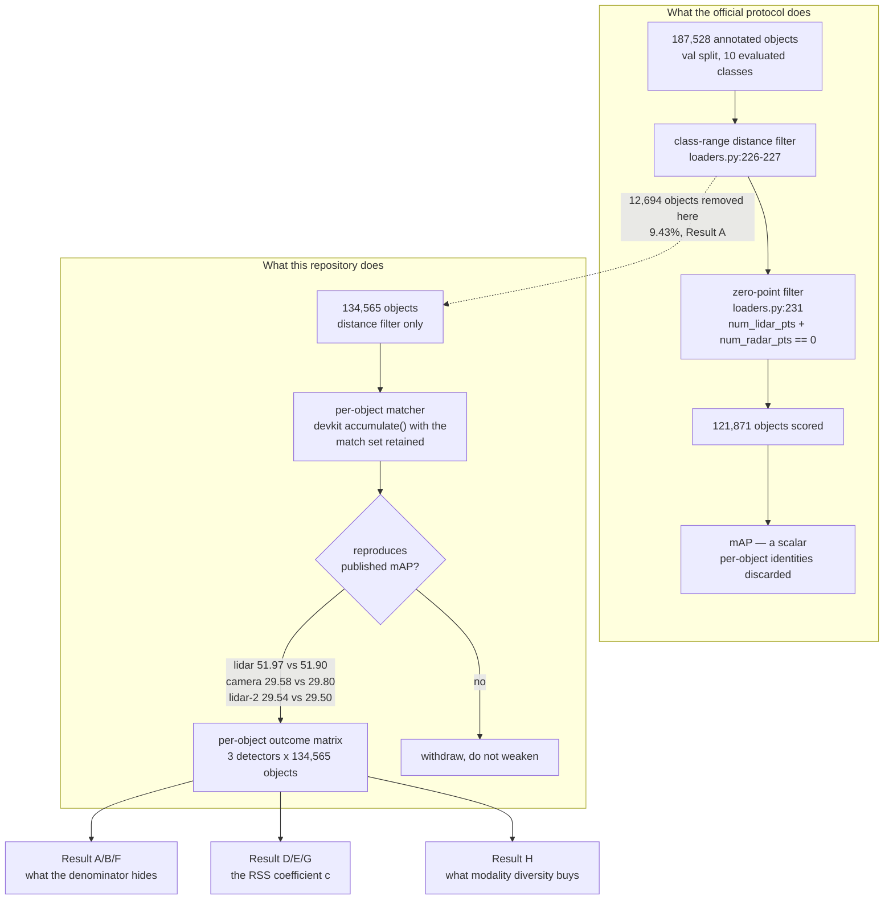

# reiyah-measure

Perception benchmarks report a scalar. That scalar is computed from a per-object outcome matrix
which every devkit builds and then discards. This repository rebuilds the matrix and asks it
questions the scalar cannot answer.

The first question was whether the denominator is honest. It is not: the official nuScenes
evaluation removes 9.43% of its validation ground truth before scoring anything. The second was
whether two sensing channels fail independently, which is the assumption underwriting every
multi-sensor safety argument. They do not.

This repository is deliberately separate from [Reiyah](https://github.com/manfromnowhere143/reiyah).
Reiyah's Gate A control GA-15 requires that its architecture contain no live inference, so dataset
analysis cannot live there without invalidating the packet. Reiyah may later admit these artifacts
through its source ledger as it would any third-party evidence. **Nothing here carries Reiyah
authority.**

## Status

| Field | Value |
|---|---|
| Lifecycle status | `proposed` |
| Result A | **measured** — 9.43% of val GT removed before scoring; ten audits passed |
| Result B | **measured** — the removal is a range-sensor criterion; inflation quantified |
| Result C | **hypothesis rejected** — the published estimate does not inherit the filter |
| Result D | **measured, superseded** — marginal lift 1.24 to 2.37 |
| Result E | **measured** — 73% of D is shared difficulty; conditional c = 1.16 |
| Result F | **measured** — B's bound closed: lidar recovers 18.13% of removed objects |
| Result G | **derived** — the real cost is **+26% evidence**; N scales as sqrt(c) |
| Result H | **measured** — 3v3 pairs, complete separation; better models fail together *more* |
| Corrections | **six claims withdrawn or corrected**, all left standing with refutations |
| Reiyah Gate B | not authorized; not required for anything here |
| Operator acceptance | none |
| Claims created | none |

A computed number is not a measurement. Nothing here is called a result until its audit passes.

## The chain



## Result A — the denominator (measured)

In `nuscenes-devkit`, `python-sdk/nuscenes/eval/common/loaders.py`:

```python
# line 231
eval_boxes.boxes[sample_token] = [box for box in eval_boxes[sample_token]
                                  if not box.num_pts == 0]
```

and at line 137, `num_pts = num_lidar_pts + num_radar_pts`. Every annotated object returning no
lidar and no radar points is deleted from the ground truth before any detector is scored.

`filter_eval_boxes` applies distance first (226-227), then this (231), then bike-rack filtering
(234+). The honest denominator is therefore boxes surviving the distance filter.

| Quantity | Value |
|---|---|
| Val annotations in the 10 evaluated classes | 187,528 |
| Removed first by the distance filter | 52,963 |
| Surviving distance filter | 134,565 |
| **Removed by the zero-point filter** | **12,694 (9.43%)** |
| Of those, annotated 80-100% camera-visible | 2,207 |

The gradients matter more than the headline. Removal runs at 4.04% within 20 m and 19.75% at
40-50 m; at 27.02% for objects annotated 0-40% camera-visible and 3.15% at 80-100%. By class:
traffic cone 15.38%, bicycle 10.97%, car 10.89%, bus 1.10%.

A zero point count means no range-sensor return fell inside the box that keyframe, which for a
distant or occluded object is expected physics rather than detector failure. The finding is not
that these objects are easy. It is that roughly one annotated object in eleven is silently absent
from every published nuScenes number, with a five-fold gradient in range.

**Audit.** Ten adversarial checks, all passing, transcript in
[`results/audit_result_a.txt`](results/audit_result_a.txt). The decisive one reproduces nuScenes'
published validation count of **6,019 samples exactly** — external validation of the join, not
internal consistency. Two independent recounts match to the object.

**Independent replication.** Re-derived on a separately obtained copy of nuScenes (file timestamps
March 2019), on different hardware, with code rewritten for the extracted directory layout. Every
figure identical: 134,565 / 12,694 / 9.43% / 2,207, and all four range-band inflations. Three axes
vary at once, so agreement is not shared-implementation agreement.
([`results/replication_independent_copy.txt`](results/replication_independent_copy.txt))

## Result B — the removal is a range-sensor criterion (measured)

The criterion is defined on range-sensor returns and nothing else, so it correlates with lidar
failure by construction and not with camera failure. Expressing a lidar-only detector's recall over
the complete in-range set rather than the filtered one:

| Stratum | N_full | N_eval | Removed | Inflation |
|---|---|---|---|---|
| **All** | 134,565 | 121,871 | 12,694 | **x1.1042** |
| 0-20 m | 54,626 | 52,418 | 2,208 | x1.0421 |
| 20-30 m | 38,242 | 34,420 | 3,822 | x1.1110 |
| 30-40 m | 26,385 | 22,745 | 3,640 | x1.1600 |
| **40-50 m** | 15,312 | 12,288 | 3,024 | **x1.2461** |

Stated as an upper bound at the time, conditional on zero keyframe returns implying non-detection.
**Result F closed that bound and the assumption was too strong** — see below.

## Result C — a hypothesis of ours, rejected

We expected Qiu's 2024 FAU dissertation, which measured camera-lidar error correlation on
nuScenes, to have inherited this filter. It did not. Qiu builds an independent pipeline: a
front-facing ROI of 30 m by 50 m split at 30 m, with Hungarian assignment on GIoU. The only
ground-truth filter described is spatial — *"Ps and GTs are filtered by the ROI"* — and the terms
`num_lidar_pts`, `num_pts`, devkit and zero-point appear nowhere in the document.

What replaced it is sharper. **Two communities measure on two different denominators and neither
has noticed.** Qiu measured dependence on an uncensored set and found false-negative correlation
of 0.43 to 0.53. The benchmark the field optimises against removes a range-sensor-selected 9.43%.
The phenomenon has been measured; the leaderboard cannot reflect it. That strengthens Qiu's work
rather than undermining it.

## Results D, E and G — the RSS coefficient

RSS ([Shalev-Shwartz, Shammah, Shashua, arXiv:1708.06374](https://arxiv.org/abs/1708.06374))
Definition 32 calls two subsystem errors *one side c-approximate independent* when
`P[r1 AND r2] <= c * P[r1] * P[r2]`, and Corollary 3 uses that to cut required validation evidence
from roughly 10⁹ examples to 10⁵. **The coefficient is never estimated in that paper.**

We measured it on the camera-only and lidar-only detection results nuScenes publishes itself.

**Marginal lift**, full denominator, by operating point: 2.271 at score ≥ 0.1, 1.878 at 0.2,
**1.587 at 0.3**, 1.363 at 0.4, 1.239 at 0.5.

**Conditional lift** (Result E), stratified on class × range × visibility at score ≥ 0.3:

| | |
|---|---|
| Marginal | 1.587 |
| **Conditional on difficulty** | **1.156** |
| Explained by shared difficulty | **73.4%** |
| Mantel-Haenszel odds ratio | 2.810 |
| CMH chi-square, 1 df | **4,924** |

Three quarters of the association is shared difficulty. The rest is not, and it is nowhere near
noise — the threshold for p < 0.001 is 10.83. The decay is what a real effect looks like: 1.525 by
class, 1.318 adding range, 1.156 adding visibility, approaching 1 and stopping above it.

**What it costs** (Result G). Both prior results had the number right and the use wrong.

Corollary 3 bounds the system-level probability integrated over the operating distribution, and a
deployed vehicle cannot condition on range — so the **marginal** lift is the operationally correct
input, not the conditional one. And evidence does not scale linearly in c:

```
P <= 6 c p²    ->    p = sqrt(P / 6c)    ->    N ~ 1/p = sqrt(6c / P)
```

Required evidence scales as **the square root of the lift**. Our reading checks against the paper's
own worked example: at target 10⁻⁹ with c = 1 this gives 77,460 examples per subsystem, and RSS
says "order of 10⁵".

| Score | marginal c | examples per subsystem | **extra evidence** |
|---|---|---|---|
| ≥ 0.1 | 2.271 | 116,730 | **50.7%** |
| ≥ 0.3 | 1.587 | 97,581 | **26.0%** |
| ≥ 0.5 | 1.239 | 86,221 | **11.3%** |

**Corollary 3 is not destroyed by the measured dependence. It is understated by about a quarter.**
Whether a quarter matters is an engineering judgement and we do not make it for anyone.

## Result F — closing Result B's bound (measured)

Result B assumed zero keyframe lidar return implies non-detection. The published detections test
it directly. At score ≥ 0.3 the lidar arm **recovers 18.13%** of the removed objects, against
71.00% of everything else.

| Score | lidar finds removed | lidar finds others | camera finds removed | camera finds others |
|---|---|---|---|---|
| ≥ 0.1 | 49.27% | 90.44% | 29.68% | 72.69% |
| ≥ 0.3 | 18.13% | 71.00% | 12.29% | 57.88% |
| ≥ 0.5 | 4.45% | 43.90% | 2.38% | 34.40% |

Multi-sweep accumulation rescues about a fifth. The assumption was directionally right and
quantitatively too strong, so the true correction is roughly 82% of the stated bound — **×1.085,
not ×1.104**.

This also tempers Result A. The camera arm finds only 12.29% of the removed objects against 57.88%
of the rest: these are hard for *everyone*, not a cache of camera-visible detections being
discarded. The 2,207 annotated at 80-100% visibility remain the cleanest subset of that claim.

## Result H — what modality diversity actually buys (measured)

Every multi-sensor safety argument rests on the premise that a second modality fails differently
from the first. It is measurable. Four published detectors on one split give six pairs: three
same-modality, three cross-modality, three distinct lidar architectures.

| Pair | Modalities | marginal c | conditional c | **cond. MH OR** |
|---|---|---|---|---|
| CenterPoint × Megvii | **lidar / lidar** | 2.698 | 1.725 | **31.99** |
| CenterPoint × PointPillars | **lidar / lidar** | 1.966 | 1.386 | **15.86** |
| Megvii × PointPillars | **lidar / lidar** | 1.712 | 1.313 | **7.01** |
| CenterPoint × Mapillary | camera / lidar | 1.827 | 1.219 | 4.33 |
| Megvii × Mapillary | camera / lidar | 1.587 | 1.156 | 2.81 |
| PointPillars × Mapillary | camera / lidar | 1.393 | 1.101 | 2.19 |

**The separation is complete.** Every same-modality pair sits above every cross-modality pair on
both estimators, with no overlap: the weakest same-modality odds ratio (7.01) exceeds the strongest
cross-modality one (4.33) by 62%. Three different lidar architectures — voxel CBGS, pillar, and
CenterPoint's centre-based head — agree, so this is a modality effect rather than an architecture
artifact.

Cross-modality pairing removes **46% of the marginal excess over independence**, and roughly two
thirds of the conditional excess.

### The part that should worry a safety engineer

Read the lidar pairs in order: **7.01, then 15.86, then 31.99** — rising monotonically with the
accuracy of *both* models. The two strongest lidar detectors fail together the most.

The mechanism is not mysterious. As a channel improves, its remaining failures concentrate on the
irreducible set — the objects no lidar model can find. Two strong models of the same modality end
up failing on nearly the same objects, so their dependence rises even as their individual error
rates fall.

**Improving both channels does not improve their independence. It worsens it.** A redundancy
argument that was sound for a pair of mediocre sensors gets weaker, not stronger, as each sensor is
upgraded — and nothing in the usual per-channel accuracy reporting would show you that happening.

### The weakness in this result

**There is only one camera model.** All three cross-modality pairs share Mapillary MonoDIS, a
2019-era monocular detector at 29.8 mAP. If it is unusual in some way, the entire cross-modality
column moves with it. The lidar side has three independent architectures; the camera side has one,
and that asymmetry is the first thing a reviewer should attack.

CenterPoint's file also carries weaker provenance than the other three. It comes from a third-party
Drive mirror rather than nuScenes, its exact variant is unconfirmed, and our matcher reconstructs
**61.59 mAP** for it — plausible for CenterPoint but **not validated against a confirmed published
figure** the way the other three are. Treat that row as indicative rather than as measured to the
same standard.

## Method

The matcher reimplements the devkit's `accumulate()` — greedy, confidence-sorted, per-class, 2D
centre distance, a claimed ground truth cannot be reclaimed — but retains the `taken` set the
devkit discards on return.

**It is validated by reproducing the official metric on all three detectors:**

| Detector | Modality | Reconstructed mAP | Published | Delta |
|---|---|---|---|---|
| Megvii CBGS | lidar | 51.97 | 51.90 | 0.07 |
| Mapillary MonoDIS | camera | 29.58 | 29.80 | 0.22 |
| PointPillars | lidar | 29.54 | 29.50 | 0.04 |
| CenterPoint | lidar | 61.59 | *unconfirmed variant* | **not validated** |

The first three are the nuScenes-hosted baselines with published figures. CenterPoint comes from a
third-party mirror without a confirmed published number for that exact file, so it is reported and
used but explicitly not held to the same standard.

That validation caught two real bugs. The devkit interpolates precision with linear `np.interp`,
not a step lookup. And `filter_eval_boxes` distance-filters the **predictions** as well as the
ground truth — omitting that turns out-of-range detections into false positives the official
protocol never sees, and cost 3.3 mAP.

## Corrections

Every claim below was published here and then withdrawn on evidence. All remain in place with
their refutations attached. A repository arguing that denominators must be stated does not get to
quietly delete its own errors.

| Claim | Verdict | Replaced by |
|---|---|---|
| Censoring biases dependence toward independence | **false**, it inflates ~3% | Result D |
| Dependence is worst at long range | **false**, worst up close | Result D |
| The published estimate inherits the filter | **false**, independent pipeline | Result C |
| Zero lidar points implies undetectable | **false**, 18.13% recovered | Result F |
| Quote the conditional coefficient against RSS | **wrong quantity** for that bound | Result G |
| Evidence scales linearly in c | **false**, it scales as sqrt(c) | Result G |

Every correction made the claim smaller.

## Reproducing

```sh
python3 tools/fetch_predictions.py predictions          # ~250 MB via HTTP range requests
gsutil cat gs://<bucket>/nuscenes/v1.0-trainval_meta.tgz | python3 tools/build_gt_cache.py gt_val_cache.json
python3 tools/match.py gt_val_cache.json predictions/megvii_val.json matched_megvii.json --validate 51.9
python3 tools/result_d.py gt_val_cache.json matched_mapillary.json matched_megvii.json
python3 tools/result_e.py gt_val_cache.json matched_mapillary.json matched_megvii.json
python3 tools/result_h.py gt_val_cache.json mapillary=... megvii=... pointpillars=...
```

No GPU. No sensor blobs. Prefer `gsutil cp` over a pipe on an unreliable connection: it verifies
CRC32C and will delete a corrupted transfer, which caught one silent corruption here that a pipe
would have carried straight into the analysis.

## Provenance

| Item | Value |
|---|---|
| Metadata | nuScenes `v1.0-trainval_meta.tgz`, 461,678,030 bytes |
| SHA-256 of analysed bytes | `db48746b10e3544d5ef619eaa3d687e3960626fe1b4422ed856711da5aa7325b` |
| Official source | `https://motional-nuscenes.s3.amazonaws.com/public/v1.0/` |
| Mirror verification | exact size plus five 512 KiB ranges byte-identical to the official source |
| Detections | nuScenes-hosted baselines, `detection-{megvii,mapillary,pointpillars}.zip` |
| Licence | CC BY-NC-SA 4.0, non-commercial research use |
| Devkit reference | `loaders.py:137,226-227,231`; `data_classes.py:54-56`; `algo.py` |

The mirror was verified rather than trusted. Provenance runs to Motional; the bucket is transport.

## Open

The stratification sequence for conditional c has not converged: 1.525 → 1.318 → 1.156 as
covariates were added. We did not condition on object size, truncation at image boundaries, motion
state, or lidar return count, and any of those could absorb more of the residual. **Conditional c
is at most 1.16 and at least 1.** Whether further stratification reaches 1 is open.

Three detectors is better than two and is still three. All are 2019-era. Modern detectors may
behave differently, and the Result H effect in particular deserves a modern pair.

## Non-claims

This repository does not claim that nuScenes is wrong, that any published detection number is
invalid, that any detector is better or worse than another, that any safety conclusion follows, or
that RSS is unsound. It reports what a documented filter removes, what three published detectors
do per object, and what follows arithmetically. Interpretation beyond that requires evidence this
repository does not hold.
